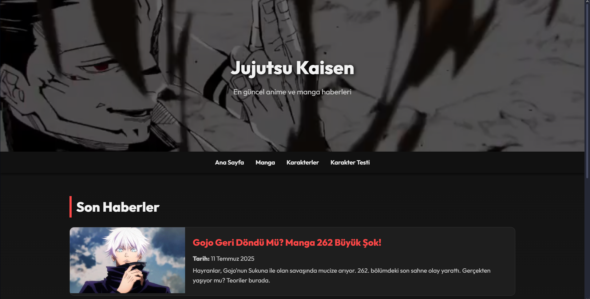
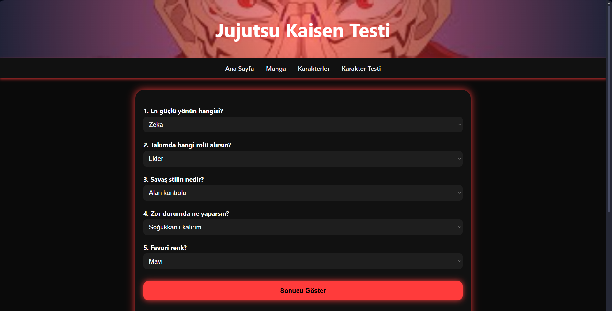

# Jujutsu Kaisen Fan Site 🌌

**[İngilizce açıklama aşağıda | Scroll down for English]**

## 🔥 Proje Özeti
Bu proje, popüler anime/manga **Jujutsu Kaisen** temalı bir bilgi ve eğlence sitesidir. HTML ve CSS kullanılarak tamamen statik olarak geliştirilmiştir. GitHub Pages üzerinden yayınlanmıştır.

## 🚀 Canlı Demo
👉 [Siteyi Görüntüle](https://batrenreee.github.io/jujutsu_site)

## 🧩 İçerik
- Ana Sayfa: Genel tanıtım ve atmosfer.
- Manga Sayfası: Serinin manga bölümleri ve detayları.
- Karakterler Sayfası: Ana karakterler hakkında bilgiler.
- Karakter Testi: Hangi Jujutsu karakterisin? Etkileşimli test.

## 🛠️ Kullanılan Teknolojiler
- HTML5
- CSS3
- GitHub Pages
- JavaScript

## 📸 Ekran Görüntüleri
| Ana Sayfa | Karakter Testi |
|-----------|----------------|
|  |  |

---

## 🇬🇧 English Description

### 🔥 Project Summary
This is a fan-made, fully static website based on the anime/manga **Jujutsu Kaisen**. Built with HTML and CSS, the site offers a fun and informative experience for fans. Hosted on GitHub Pages.

### 🚀 Live Demo
👉 [Visit the Website](https://batrenreee.github.io/jujutsu_site)

### 🧩 Pages
- **Home**: Introductory and atmospheric content
- **Manga**: Manga-related info and chapters
- **Characters**: Key character profiles
- **Character Quiz**: Find out which Jujutsu Kaisen character you are

### 🛠️ Tech Stack
- HTML5
- CSS3
- GitHub Pages
- JavaScript

### 📸 Screenshots
| Home Page | Quiz Page |
|-----------|-----------|
|  |  |

---

## 👤 Geliştirici / Developer

**Eren**  
📧 GitHub: [@batrenreee](https://github.com/batrenreee)

---

## 📌 Lisans / License

Bu proje sadece eğitim ve eğlence amaçlıdır.  
This project is for educational and entertainment purposes only.

