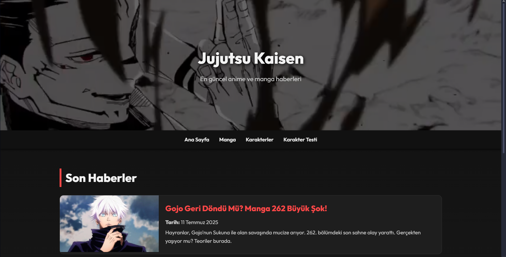
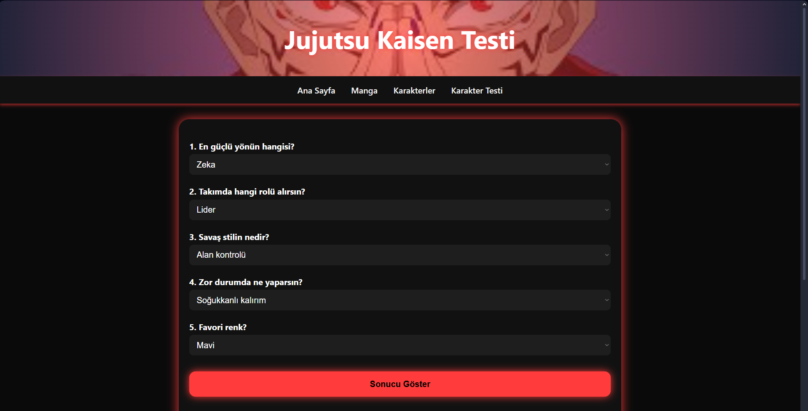

# Jujutsu Kaisen Fan Site 🤞🌌

---

## 🔥 About the Project

This is a modern, interactive fan website dedicated to the acclaimed anime and manga series, **Jujutsu Kaisen**. Originally launched as a static HTML project, it has been upgraded to "Special Grade" with dynamic features such as **Live Search**, a **Logic-Based Character Quiz**, and **Advanced CSS Animations**.

The design carefully reflects the dark, chaotic atmosphere of the series. It features a "Dark Mode" aesthetic, enhanced by red and purple "Cursed Energy" visual effects.

## 🚀 Live Demo

👉 **[(Visit the Website)](https://batrenreee.github.io/jujutsu_site)**

## ⚡ Key Features

* **Dynamic Character Search:** A JavaScript-powered search engine that filters characters in real-time.
* **Interactive Character Quiz:** A logic-based assessment featuring a scoring system, custom loading animations, and highly visual result cards.
* **Manga Archive:** Stylish UI card layouts designed for tracking the latest manga chapters.
* **Visual Effects:** Smooth transitions, zoom interactions, and signature "Cursed Energy" hover effects.
* **Responsive Design:** Fully optimized for seamless viewing across mobile, tablet, and desktop devices.

## 🛠️ Tech Stack

* **HTML5:** Semantic structuring (Header, Nav, Main, Article).
* **CSS3:** Flexbox, Grid System, Keyframe Animations, and Custom Gradients.
* **JavaScript (ES6+):** DOM Manipulation, Event Listeners, and Logic Algorithms.

## 📸 Screenshots

| Home Page | Quiz Page (Result Screen) |
|:---:|:---:|
|  |  |

---

## 👤 Developer

**Eren** 📧 GitHub: [@batrenreee](https://github.com/batrenreee)

---

## 📌 License

This project is created for educational and entertainment purposes only. All Jujutsu Kaisen assets and properties belong to their respective creators and publishers.
